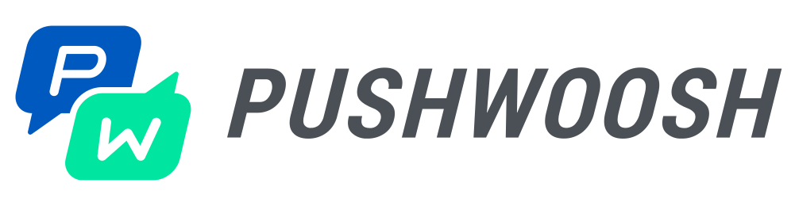

<p align="center">
  
</p>

<h1 align="center">Pushwoosh iOS SDK</h1>

<p align="center">
  <a href="https://www.apple.com/ios/"></a>
  <a href="https://swift.org"></a>
  <a href="https://developer.apple.com/library/archive/documentation/Cocoa/Conceptual/ProgrammingWithObjectiveC/Introduction/Introduction.html"></a>
  <a href="LICENSE"></a>
</p>

<p align="center">
  Push notifications, In-App Messaging, and more for iOS, tvOS, and watchOS applications.
</p>

## Table of Contents

- [Documentation](#documentation)
- [Features](#features)
- [Installation](#installation)
  - [Swift Package Manager](#swift-package-manager-recommended)
  - [CocoaPods](#cocoapods)
- [AI-Assisted Integration](#ai-assisted-integration)
- [Quick Start](#quick-start)
- [Modules](#modules)
- [Support](#support)
- [License](#license)

## Documentation

[](https://pushwoosh.github.io/pushwoosh-ios-sdk/PushwooshiOS/documentation/pushwooshframework/)
[](https://pushwoosh.github.io/pushwoosh-ios-sdk/PushwooshVoIP/documentation/pushwooshvoip/)
[](https://pushwoosh.github.io/pushwoosh-ios-sdk/PushwooshLiveActivities/documentation/pushwooshliveactivities/)
[](https://pushwoosh.github.io/pushwoosh-ios-sdk/PushwooshTVOS/documentation/pushwooshtvos/)
[](https://pushwoosh.github.io/pushwoosh-ios-sdk/PushwooshForegroundPush/documentation/pushwooshforegroundpush/)
[](https://pushwoosh.github.io/pushwoosh-ios-sdk/PushwooshKeychain/documentation/pushwooshkeychain/)
[](https://pushwoosh.github.io/pushwoosh-ios-sdk/PushwooshGRPC/documentation/pushwooshgrpc/)

## Features

### Core SDK
- **Push Notifications** - Standard push notifications with rich media support
- **In-App Messages** - Customizable in-app messaging
- **Tags & Segmentation** - User targeting and segmentation
- **Inbox** - Built-in message inbox functionality
- **Analytics** - Delivery and conversion tracking

### Advanced Modules
- **VoIP Push Notifications** - CallKit integration for VoIP apps
- **Live Activities** - iOS 16.1+ Live Activities with push updates
- **tvOS Support** - Push notifications and Rich Media for Apple TV
- **Foreground Push** - Custom foreground notifications with animations and effects

## Installation

### Swift Package Manager (Recommended)

In Xcode, go to **File → Add Package Dependencies** and enter:

```
https://github.com/Pushwoosh/Pushwoosh-XCFramework
```

Select the modules you need in your target's **Frameworks, Libraries, and Embedded Content** section.

**Available modules:**
- `PushwooshFramework` - Core SDK **(required)**
- `PushwooshCore` - Core functionality **(required)**
- `PushwooshBridge` - Bridge module **(required)**
- `PushwooshLiveActivities` - Live Activities support *(optional)*
- `PushwooshVoIP` - VoIP push notifications *(optional)*
- `PushwooshTVOS` - tvOS support *(optional)*
- `PushwooshForegroundPush` - Custom foreground notifications *(optional)*
- `PushwooshKeychain` - Persistent device ID across app reinstalls *(optional)*
- `PushwooshGRPC` - gRPC transport for improved performance *(optional)*

---

### CocoaPods

Add to your `Podfile`:

```ruby
# Core SDK
pod 'PushwooshXCFramework'

# Optional modules
pod 'PushwooshXCFramework/PushwooshLiveActivities'
pod 'PushwooshXCFramework/PushwooshVoIP'
pod 'PushwooshXCFramework/PushwooshTVOS'
pod 'PushwooshXCFramework/PushwooshForegroundPush'
pod 'PushwooshXCFramework/PushwooshKeychain'
pod 'PushwooshXCFramework/PushwooshGRPC'
pod 'PushwooshInboxUIXCFramework'
```

Then run:
```bash
pod install
```

## AI-Assisted Integration

Integrate Pushwoosh iOS SDK using AI coding assistants (Claude Code, Cursor, GitHub Copilot, etc.).

> **Requirement:** Your AI assistant must have access to [Context7](https://context7.com/) MCP server or web search capabilities.

### Quick Start Prompts

Choose the prompt that matches your task:

---

#### 1. Basic SDK Integration

```
Integrate Pushwoosh iOS SDK into my iOS project using Swift Package Manager.

Requirements:
- Add SPM dependency from https://github.com/Pushwoosh/Pushwoosh-XCFramework
- Configure Info.plist with Pushwoosh App ID: YOUR_APP_ID
- Register for push notifications in AppDelegate

Use Context7 MCP to fetch Pushwoosh iOS SDK documentation.
```

---

#### 2. Custom Push Notification Handling

```
Show me how to handle push notification callbacks (receive, open) with Pushwoosh SDK in iOS. I want to implement PWMessagingDelegate and add analytics tracking for these events.

Use Context7 MCP to fetch Pushwoosh iOS SDK documentation for PWMessagingDelegate.
```

---

#### 3. User Segmentation with Tags

```
Show me how to use Pushwoosh tags for user segmentation in iOS. Create example helper class with methods for setting and getting tags.

Use Context7 MCP to fetch Pushwoosh iOS SDK documentation for setTags and getTags.
```

---

#### 4. Live Activities Integration

```
Integrate Pushwoosh Live Activities into my iOS app. Show me how to:
- Create an ActivityAttributes model
- Start a Live Activity
- Update it via push notifications

Use Context7 MCP to fetch PushwooshLiveActivities documentation.
```

---

## Quick Start

### 1. Initialize SDK

```swift
import PushwooshFramework

func application(_ application: UIApplication,
                didFinishLaunchingWithOptions launchOptions: [UIApplication.LaunchOptionsKey: Any]?) -> Bool {

    Pushwoosh.sharedInstance().registerForPushNotifications()

    return true
}
```

### 2. Handle Device Token

```swift
func application(_ application: UIApplication,
                didRegisterForRemoteNotificationsWithDeviceToken deviceToken: Data) {
    Pushwoosh.sharedInstance().handlePushRegistration(deviceToken)
}
```

### 3. Process Notifications

```swift
func application(_ application: UIApplication,
                didReceiveRemoteNotification userInfo: [AnyHashable: Any],
                fetchCompletionHandler completionHandler: @escaping (UIBackgroundFetchResult) -> Void) {

    Pushwoosh.sharedInstance().handlePushReceived(userInfo)
    completionHandler(.newData)
}
```

## Modules

### [Pushwoosh](https://pushwoosh.github.io/pushwoosh-ios-sdk/PushwooshiOS/documentation/pushwooshframework/)
Core SDK for push notifications, in-app messages, and analytics.

**Requirements:** iOS 11.0+ | Swift 5.0+

### [PushwooshVoIP](https://pushwoosh.github.io/pushwoosh-ios-sdk/PushwooshVoIP/documentation/pushwooshvoip/)
VoIP push notifications with CallKit integration.

**Requirements:** iOS 14.0+ | CallKit

### [PushwooshLiveActivities](https://pushwoosh.github.io/pushwoosh-ios-sdk/PushwooshLiveActivities/documentation/pushwooshliveactivities/)
Live Activities support with push-to-start (iOS 17.2+) and real-time updates.

**Requirements:** iOS 16.1+ | WidgetKit | ActivityKit

### [PushwooshTVOS](https://pushwoosh.github.io/pushwoosh-ios-sdk/PushwooshTVOS/documentation/pushwooshtvos/)
Push notifications and Rich Media HTML for Apple TV.

**Requirements:** tvOS 11.0+

### [PushwooshForegroundPush](https://pushwoosh.github.io/pushwoosh-ios-sdk/PushwooshForegroundPush/documentation/pushwooshforegroundpush/)
Custom foreground notifications with animations, haptic feedback, and visual effects.

**Requirements:** iOS 13.0+ | Supports Liquid Glass effect on iOS 26+

### [PushwooshKeychain](https://pushwoosh.github.io/pushwoosh-ios-sdk/PushwooshKeychain/documentation/pushwooshkeychain/)
Persistent device identification (HWID) that survives app reinstallation using Keychain storage.

**Requirements:** iOS 11.0+

### PushwooshGRPC
Optional gRPC transport layer for improved network performance. Automatically falls back to REST if unavailable.

**Requirements:** iOS 13.0+

## Support

- 📖 [Documentation](https://docs.pushwoosh.com/)
- 💬 [Support Portal](https://support.pushwoosh.com/)
- 🐛 [Report Issues](https://github.com/Pushwoosh/pushwoosh-ios-sdk/issues)

## License

Pushwoosh iOS SDK is available under the MIT license. See [LICENSE](LICENSE) for details.

---

Made with ❤️ by [Pushwoosh](https://www.pushwoosh.com/)
