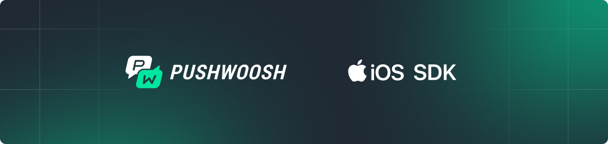

<p align="center">
  
</p>

<p align="center">
  <a href="https://www.apple.com/ios/"></a>
  <a href="https://swift.org"></a>
  <a href="https://developer.apple.com/library/archive/documentation/Cocoa/Conceptual/ProgrammingWithObjectiveC/Introduction/Introduction.html"></a>
  <a href="LICENSE"></a>
</p>

<p align="center">
  Push notifications, In-App Messaging, and more for iOS, tvOS, and watchOS applications.
</p>

## Table of Contents

- [Documentation](#documentation)
- [Features](#features)
- [Installation](#installation)
  - [Swift Package Manager](#swift-package-manager-recommended)
  - [CocoaPods](#cocoapods)
- [AI-Assisted Integration](#ai-assisted-integration)
- [Quick Start](#quick-start)
- [Multiple Pushwoosh applications (multi-region)](#multiple-pushwoosh-applications-multi-region)
- [Modules](#modules)
- [Support](#support)
- [License](#license)

## Documentation

[](https://pushwoosh.github.io/pushwoosh-ios-sdk/PushwooshiOS/documentation/pushwooshframework/)
[](https://pushwoosh.github.io/pushwoosh-ios-sdk/PushwooshCore/documentation/pushwooshcore/)
[](https://pushwoosh.github.io/pushwoosh-ios-sdk/PushwooshVoIP/documentation/pushwooshvoip/)
[](https://pushwoosh.github.io/pushwoosh-ios-sdk/PushwooshLiveActivities/documentation/pushwooshliveactivities/)
[](https://pushwoosh.github.io/pushwoosh-ios-sdk/PushwooshInboxKit/documentation/pushwooshinboxkit/)
[](https://pushwoosh.github.io/pushwoosh-ios-sdk/PushwooshTVOS/documentation/pushwooshtvos/)
[](https://pushwoosh.github.io/pushwoosh-ios-sdk/PushwooshForegroundPush/documentation/pushwooshforegroundpush/)
[](https://pushwoosh.github.io/pushwoosh-ios-sdk/PushwooshKeychain/documentation/pushwooshkeychain/)
[](https://pushwoosh.github.io/pushwoosh-ios-sdk/PushwooshGRPC/documentation/pushwooshgrpc/)
[](https://pushwoosh.github.io/pushwoosh-ios-sdk/PushwooshNotificationUI/documentation/pushwooshnotificationui/)
[](https://pushwoosh.github.io/pushwoosh-ios-sdk/PushwooshInApp/documentation/pushwooshinapp/)

## Features

### Core SDK
- **Push Notifications** - Standard push notifications with rich media support
- **In-App Messages** - Customizable in-app messaging
- **Tags & Segmentation** - User targeting and segmentation
- **Inbox** - Built-in message inbox functionality
- **Analytics** - Delivery and conversion tracking

### Advanced Modules
- **VoIP Push Notifications** - CallKit integration for VoIP apps
- **Live Activities** - iOS 16.1+ Live Activities with push updates
- **InboxKit** - Modern UIKit inbox UI with banner / captioned / classic cards, inline CTAs and pinning
- **In-App Messages** - Native modal, sheet, carousel, stories, banner and fullscreen in-apps rendered without a webview
- **tvOS Support** - Push notifications and Rich Media for Apple TV
- **Foreground Push** - Custom foreground notifications with animations and effects
- **Push Stories** - Full-screen, Instagram-style stories in an expanded notification

## Installation

### Swift Package Manager (Recommended)

In Xcode, go to **File → Add Package Dependencies** and enter:

```
https://github.com/Pushwoosh/Pushwoosh-XCFramework
```

Select the modules you need in your target's **Frameworks, Libraries, and Embedded Content** section.

**Available modules:**
- `PushwooshFramework` - Core SDK **(required)**
- `PushwooshCore` - Core functionality **(required)**
- `PushwooshBridge` - Bridge module **(required)**
- `PushwooshLiveActivities` - Live Activities support *(optional)*
- `PushwooshInboxKit` - Modern UIKit inbox UI *(optional)*
- `PushwooshVoIP` - VoIP push notifications *(optional)*
- `PushwooshTVOS` - tvOS support *(optional)*
- `PushwooshForegroundPush` - Custom foreground notifications *(optional)*
- `PushwooshKeychain` - Persistent device ID across app reinstalls *(optional)*
- `PushwooshGRPC` - gRPC transport for improved performance *(optional)*
- `PushwooshNotificationUI` - Full-screen push stories UI for a Notification Content Extension *(optional)*
- `PushwooshInApp` - Native in-app messages: modal, sheet, carousel, stories, banner, fullscreen *(optional)*

---

### CocoaPods

Add to your `Podfile`:

```ruby
# Core SDK
pod 'PushwooshXCFramework'

# Optional modules
pod 'PushwooshXCFramework/PushwooshLiveActivities'
pod 'PushwooshXCFramework/PushwooshInboxKit'
pod 'PushwooshXCFramework/PushwooshVoIP'
pod 'PushwooshXCFramework/PushwooshTVOS'
pod 'PushwooshXCFramework/PushwooshForegroundPush'
pod 'PushwooshXCFramework/PushwooshKeychain'
pod 'PushwooshXCFramework/PushwooshGRPC'
pod 'PushwooshXCFramework/PushwooshNotificationUI'
pod 'PushwooshXCFramework/PushwooshInApp'
```

Then run:
```bash
pod install
```

## AI-Assisted Integration

Integrate Pushwoosh iOS SDK using AI coding assistants (Claude Code, Cursor, GitHub Copilot, etc.).

> **Requirement:** Your AI assistant must have access to [Context7](https://context7.com/) MCP server or web search capabilities.

### Quick Start Prompts

Choose the prompt that matches your task:

---

#### 1. Basic SDK Integration

```
Integrate Pushwoosh iOS SDK into my iOS project using Swift Package Manager.

Requirements:
- Add SPM dependency from https://github.com/Pushwoosh/Pushwoosh-XCFramework
- Configure Info.plist with Pushwoosh App ID: YOUR_APP_ID
- Register for push notifications in AppDelegate

Use Context7 MCP to fetch Pushwoosh iOS SDK documentation.
```

---

#### 2. Custom Push Notification Handling

```
Show me how to handle push notification callbacks (receive, open) with Pushwoosh SDK in iOS. I want to implement PWMessagingDelegate and add analytics tracking for these events.

Use Context7 MCP to fetch Pushwoosh iOS SDK documentation for PWMessagingDelegate.
```

---

#### 3. User Segmentation with Tags

```
Show me how to use Pushwoosh tags for user segmentation in iOS. Create example helper class with methods for setting and getting tags.

Use Context7 MCP to fetch Pushwoosh iOS SDK documentation for setTags and getTags.
```

---

#### 4. Live Activities Integration

```
Integrate Pushwoosh Live Activities into my iOS app. Show me how to:
- Create an ActivityAttributes model
- Start a Live Activity
- Update it via push notifications

Use Context7 MCP to fetch PushwooshLiveActivities documentation.
```

---

## Quick Start

### 1. Initialize SDK

```swift
import PushwooshFramework

func application(_ application: UIApplication,
                didFinishLaunchingWithOptions launchOptions: [UIApplication.LaunchOptionsKey: Any]?) -> Bool {

    Pushwoosh.sharedInstance().registerForPushNotifications()

    return true
}
```

> **Changing the Application Code at runtime now unregisters the device from the one it leaves.**
> If your app calls `Pushwoosh.configure.setAppCode(_:)` or `Pushwoosh.initializeWithAppCode(_:)` with a
> **different** code than the one already in use (a dev/prod toggle, an A/B setup, a multi-tenant host
> app), the SDK sends an `unregisterDevice` to the previous application, addressed to that
> application's own host, so the device stops receiving its pushes. The push token is kept, so the
> device registers into the new application right away, and the server keeps the device, its tags and
> its user in the application being left. Passing the code that is already in use changes nothing and
> sends nothing. See
> [Multiple Pushwoosh applications](#multiple-pushwoosh-applications-multi-region) for moving an
> application and its API endpoint together.

### 2. Handle Device Token

```swift
func application(_ application: UIApplication,
                didRegisterForRemoteNotificationsWithDeviceToken deviceToken: Data) {
    Pushwoosh.sharedInstance().handlePushRegistration(deviceToken)
}
```

### 3. Process Notifications

```swift
func application(_ application: UIApplication,
                didReceiveRemoteNotification userInfo: [AnyHashable: Any],
                fetchCompletionHandler completionHandler: @escaping (UIBackgroundFetchResult) -> Void) {

    Pushwoosh.sharedInstance().handlePushReceived(userInfo)
    completionHandler(.newData)
}
```

## Multiple Pushwoosh applications (multi-region)

One app can serve several Pushwoosh applications — typically several regions, or a white-label
deployment where each application lives behind its own API endpoint. `setAppCode(_:baseUrl:)` moves
the Application Code and the API base URL together, atomically, and the selection survives app
restarts.

```swift
import PushwooshFramework

// Full endpoint, including the path — the SDK does not build "<appCode>.<host>" for you
Pushwoosh.configure.setAppCode("BBBBB-22222",
                               baseUrl: "https://BBBBB-22222.api.example-region.com/json/1.3/")

// No endpoint supplied: same as setAppCode("AAAAA-11111"), so this moves the application
// and lets the default endpoint of that application take over
Pushwoosh.configure.setAppCode("AAAAA-11111", baseUrl: nil)

let endpoint = Pushwoosh.configure.getBaseUrl()
```

**What a switch does**

- Unregisters the device from the previous application and re-registers it in the new one. The server
  keeps the device, its tags and its user in the application being left, so coming back later loses
  no data. The unregister is retried inside the session and, when those attempts fail, persisted and
  retried on later launches, so a device that switched while its old host was unreachable still
  leaves that application. It is bounded by the retry policy (a few attempts, and a few days of
  queue lifetime), and attempts are consumed even while server communication is stopped.
- Drops pending cached statistics events that belong to the previous application instead of replaying
  them. Events queued for another host of the *same* application are kept and sent to the current one.
- A switch that changes only the URL (same Application Code) is an address migration, not a change of
  target: it sends nothing. No unregister, and no forced registration either, since the same
  Application Code on another host is the same logical backend. Requests are re-pointed at once and the
  device introduces itself to the new host with the next ordinary registration update.

**Repeat calls, and server-side rotation.** Calling `setAppCode(_:baseUrl:)` with the Application Code
and the endpoint already in use is a no-op, so it is safe to call on every app start. Pushwoosh may
legitimately move your traffic to another host of the same application (a shard rotation); that move
outranks your endpoint and survives a restart, and a warning is logged when the new host leaves the
domain you selected. Your next call carrying your own pair puts your endpoint back in one call, with no
unregister and no data loss, because the Application Code did not move.

**Info.plist coexistence.** `Pushwoosh_APPID`, `Pushwoosh_APPID_Dev` and `Pushwoosh_BASEURL` are the
seed/default only — a runtime switch outranks all three and keeps doing so after a restart. With more
than one application, do not put an application-specific URL in Info.plist; pass it explicitly every
time, otherwise a call that supplies no endpoint resolves to that plist URL.

> **Once an install has switched, Info.plist can no longer move it.** The selected Application Code
> wins on every launch, in the app and in the Notification Service Extension, so shipping an app update
> with a different `Pushwoosh_APPID` does **not** migrate installs that have ever called
> `setAppCode(_:baseUrl:)`. Move them from the app instead:
> `Pushwoosh.configure.setAppCode("<new code>", baseUrl: nil)`.

**Changing only the Application Code.** The one-argument `setAppCode(_:)` moves the Application Code
alone. Passing the code that is already selected changes nothing. Passing a **different** one is an
application change: an endpoint selected earlier with `setAppCode(_:baseUrl:)` is dropped and the
default takes over (Info.plist `Pushwoosh_BASEURL`, otherwise the derived host), with a warning in
the log — one application's data is never addressed to the host chosen for another. It also unregisters
the device from the application it leaves, exactly like the two-argument form. Use
`setAppCode(_:baseUrl:)` to move an application and its endpoint together.

> **Do not keep passing a build-time Application Code at launch.** Once you use
> `setAppCode(_:baseUrl:)`, a one-argument `setAppCode(_:)` or `Pushwoosh.initializeWithAppCode(_:)`
> call on every launch (the default shape of most cross-platform wrappers — the legacy initializer
> routes into the same setter) carries a static build-time code, which stops matching the moment the
> user selects another application. From then on every launch is an application change: the device is
> unregistered from the selected application and the chosen endpoint is dropped, so the selection does
> not survive a restart. Remove that call, or replace it with the two-argument form carrying the pair
> you actually want, since repeating the same pair is a no-op and is safe on every launch.

> **Writing a binding?** `baseUrl: nil` — and equally an **empty** or whitespace-only string — means
> "no endpoint supplied" and makes the call behave exactly like the one-argument `setAppCode(_:)`, so
> forwarding an optional your caller never passed cannot destroy the selection, whichever of the three
> your bridge renders an absent value as. `setAppId(appId, baseUrl)` on Android reads `null` and the
> empty string the same way, so a bridge rendering an absent value as either is covered on both
> platforms; a whitespace-only string is read as absent on iOS only.

**First launch, before the user has chosen.** Omit `Pushwoosh_APPID` from Info.plist. With no
Application Code every request is queued — nothing leaks to a wrong application and nothing is lost —
until the first `setAppCode(_:baseUrl:)`. If the key must stay, set
`Pushwoosh_ALLOW_SERVER_COMMUNICATION = NO` and call `Pushwoosh.configure.startServerCommunication()`
after the choice instead.

**Notification Service Extension.** Add the same `PW_APP_GROUPS_NAME` App Group to the app *and* the
extension target, otherwise the extension cannot see the selected application and delivery events
keep going to the Info.plist application.

> **Not covered by the switch:** the advertising-id endpoint (`Pushwoosh_TRACKING_URL`), the gRPC host
> (`Pushwoosh_GRPC_HOST`) and rich-media / CDN downloads stay where their own configuration points. An
> integrator with a data-residency requirement must either not enable IDFA / gRPC, or point those keys
> at a host acceptable for every application.

## Modules

### [Pushwoosh](https://pushwoosh.github.io/pushwoosh-ios-sdk/PushwooshiOS/documentation/pushwooshframework/)
Core SDK for push notifications, in-app messages, and analytics.

**Requirements:** iOS 11.0+ | Swift 5.0+

### [PushwooshVoIP](https://pushwoosh.github.io/pushwoosh-ios-sdk/PushwooshVoIP/documentation/pushwooshvoip/)
VoIP push notifications with CallKit integration.

**Requirements:** iOS 14.0+ | CallKit

### [PushwooshLiveActivities](https://pushwoosh.github.io/pushwoosh-ios-sdk/PushwooshLiveActivities/documentation/pushwooshliveactivities/)
Live Activities support with push-to-start (iOS 17.2+) and real-time updates.

**Requirements:** iOS 16.1+ | WidgetKit | ActivityKit

### [PushwooshInboxKit](https://pushwoosh.github.io/pushwoosh-ios-sdk/PushwooshInboxKit/documentation/pushwooshinboxkit/)
Modern UIKit inbox UI with three default cells (Banner / Captioned / Classic), inline CTA buttons, pinning, and code- or server-driven cell selection.

**Requirements:** iOS 13.0+ | UIKit

### [PushwooshTVOS](https://pushwoosh.github.io/pushwoosh-ios-sdk/PushwooshTVOS/documentation/pushwooshtvos/)
Push notifications and Rich Media HTML for Apple TV.

**Requirements:** tvOS 11.0+

### [PushwooshForegroundPush](https://pushwoosh.github.io/pushwoosh-ios-sdk/PushwooshForegroundPush/documentation/pushwooshforegroundpush/)
Custom foreground notifications with animations, haptic feedback, and visual effects.

**Requirements:** iOS 13.0+ | Supports Liquid Glass effect on iOS 26+

### [PushwooshKeychain](https://pushwoosh.github.io/pushwoosh-ios-sdk/PushwooshKeychain/documentation/pushwooshkeychain/)
Persistent device identification (HWID) that survives app reinstallation using Keychain storage.

**Requirements:** iOS 11.0+

### PushwooshGRPC
Optional gRPC transport layer for improved network performance. Automatically falls back to REST if unavailable.

**Requirements:** iOS 13.0+

### [PushwooshNotificationUI](https://pushwoosh.github.io/pushwoosh-ios-sdk/PushwooshNotificationUI/documentation/pushwooshnotificationui/)
Full-screen, Instagram-style push stories rendered in a Notification Content Extension. Subclass `PushwooshStoriesViewController` and drive it with a `pw_stories` payload.

**Requirements:** iOS 13.0+ | UIKit

### [PushwooshInApp](https://pushwoosh.github.io/pushwoosh-ios-sdk/PushwooshInApp/documentation/pushwooshinapp/)
Native in-app messages rendered without a webview - modal, sheet, carousel, stories, banner, fullscreen, video, PiP, scratch card and spin wheel. Presented automatically from campaigns, or manually via `Pushwoosh.inApp.present(_:)`.

**Requirements:** iOS 13.0+ | UIKit

## Support

- 📖 [Documentation](https://docs.pushwoosh.com/)
- 💬 [Support Portal](https://support.pushwoosh.com/)
- 🐛 [Report Issues](https://github.com/Pushwoosh/pushwoosh-ios-sdk/issues)

## License

Pushwoosh iOS SDK is available under the MIT license. See [LICENSE](LICENSE) for details.

---

Made with ❤️ by [Pushwoosh](https://www.pushwoosh.com/)
